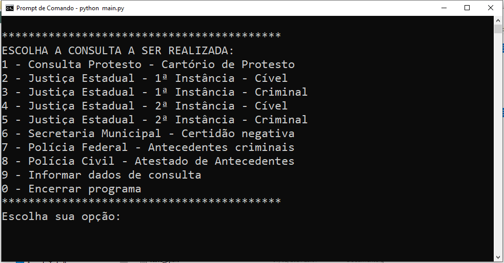
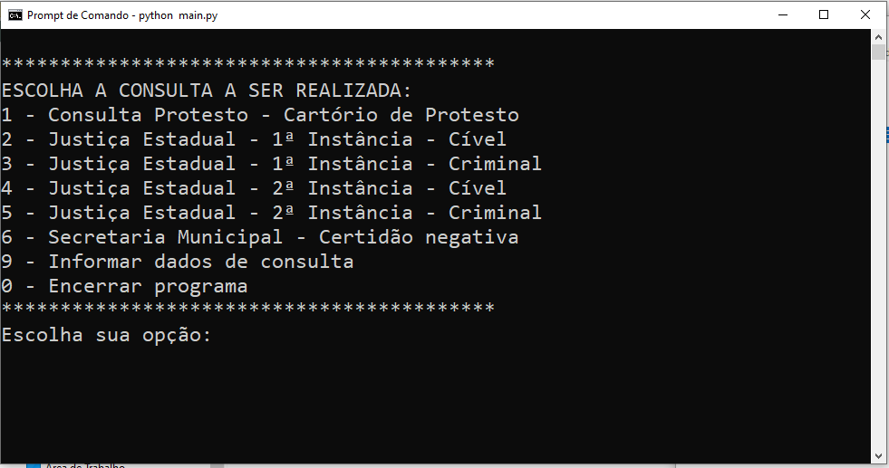

# Consultas Públicas

## Descrição
Este projeto é fruto do meu trabalho de conclusão de curso
do MBA em Tecnologia para Negócios pela Pontifícia Universidade
Católica do Rio Grande do Sul - PUC-RS. É uma ferramenta
criada para resolver o problema de consultas frequentes feita
pelo setor de Controle Interno do SICOOB Credinosso. <br>

Como entrada, o programa usa dados de uma pessoa 
física ou jurídica para realizar consultas a dados públicos, 
como Polícia Federal, Polícia Civil e Justiça Estadual de MG. 
Foi feito para ser executado em ambientes Windows. Ao final, 
o usuário interage com a tela para executar tarefas manuais 
como CAPTCHA e conclui o download do documento.


Tabela de conteúdos
=================
<!--ts-->
   * [Features](#features)
   * [Demonstração da Aplicação?](#Demonstração-da-Aplicação)
      * [Pré-Requisitos](#pre-requisitos)
      * [Local files](#local-files)
      * [Remote files](#remote-files)
      * [Multiple files](#multiple-files)
      * [Combo](#combo)
   * [Testes](#testes)
   * [Tecnologias](#tecnologias)
   * [Teste](#demonstração-da-aplicação)
<!--te-->

<h4 align="center"> 
	Status: protótipo concluído
</h4>

## Features

- [x] Consulta de Protesto - Cartório de Protesto
- [x] Justiça Estadual (MG) - 1ª Instância - Cível
- [x] Justiça Estadual (MG) - 1ª Instância - Criminal
- [x] Justiça Estadual (MG) - 2ª Instância - Cível
- [x] Justiça Estadual (MG) - 2ª Instância - Criminal
- [x] Secretaria Municipal - Montes Claros/MG - Certidão Negativa
- [x] Polícia Federal - Antecedentes Criminais (Apenas Pessoa Física)
- [x] Polícia Civil - Atestado de Antecedentes (Apenas Pessoa Física)

## Demonstração da Aplicação
1) A primeira tela do programa solicita os dados a serem consultados
nas plataformas públicas. São solicitados os dados do requisitante
também.
<h1 align="center">
  
</h1>

2) Caso a consulta seja de alguma pessoa física, são
apresentadas as consultas possíveis.

<h1 align="center">
  
</h1>

3) Caso a consulta seja de alguma pessoa jurídica, são
apresentadas as consultas possíveis (as pessoa físicas
   têm mais opções)
<h1 align="center">
  
</h1>

## Pré-Requisitos
É necessário ter instalado:
- Python 3: https://www.python.org/
- Selenium: https://www.selenium.dev/downloads/
- Google Chrome WebDriver: https://sites.google.com/a/chromium.org/chromedriver/downloads

No Windows, é importante lembrar-se de instalar a ferramenta
pip.

Opcionalmente, pode-se gerar um arquivo executável para
não ser necessário instalar o Python para executar o programa.
Para isso, recomenda-se o uso da ferramenta cx_Freeze (tutorial
em https://civcomunb.wordpress.com/2016/08/28/criando-executaveis-com-cx_freeze/).

O arquivo setup.py está configurado para gerar o executável
com essa ferramenta. Para isso, utiliza-se o comando:
```bash
$ python setup.py build
```

Este comando cria um executável na pasta build que fica
no diretório raiz clonado.

## Como executar a aplicação
Para executar a aplicação, primeiro clona-se este repositório:
```bash
$ git clone https://github.com/IgorAlberte/consultas-publicas
```

Vá até a pasta baixada e execute o arquivo main
```bash
$ python main.py
```

## Tecnologias utilizadas
As seguintes ferramentas foram usadas para o desenvolvimento
do projeto
- [Python 3] (https://www.python.org/)
- [Selenium] (https://www.selenium.dev/)
- [Cx_Freeze] (https://pypi.org/project/cx-Freeze/)

## Autor
Igor Alberte
Entre em contato
- Instagram: @igoralberte
- E-mail: igoralberte@gmail.com

