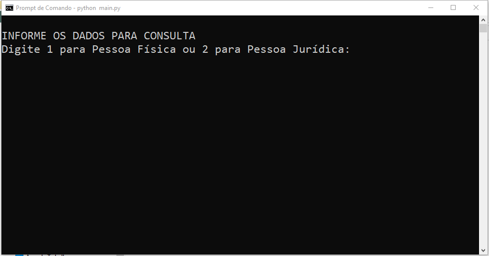

# Consultas Públicas

## Descrição
Este projeto é fruto do meu trabalho de conclusão de curso
do MBA em Tecnologia para Negócios pela Pontifícia Universidade
Católica do Rio Grande do Sul - PUC-RS. É uma ferramenta
criada para resolver o problema de consultas frequentes feita
pelo setor de Controle Interno do SICOOB Credinosso.  

Como entrada, o programa usa dados de uma pessoa 
física ou jurídica para realizar consultas a dados públicos, 
como Polícia Federal, Polícia Civil e Justiça Estadual de MG. 
Foi feito para ser executado em ambientes Windows. Ao final, 
o usuário interage com a tela para executar tarefas manuais 
como CAPTCHA e conclui o download do documento.

Tabela de conteúdos
=================
<!--ts-->
   * [Sobre](#Sobre)
   * [Tabela de Conteúdo](#tabela-de-conteudo)
   * [Instalação](#instalacao)
   * [Como usar?](#como-usar)
      * [Pré-Requisitos](#pre-requisitos)
      * [Local files](#local-files)
      * [Remote files](#remote-files)
      * [Multiple files](#multiple-files)
      * [Combo](#combo)
   * [Testes](#testes)
   * [Tecnologias](#tecnologias)
   * [Teste](#demonstração-da-aplicação)
<!--te-->

<h4 align="center"> 
	Status: protótipo concluído
</h4>

## Features

- [x] Consulta de Protesto - Cartório de Protesto
- [x] Justiça Estadual (MG) - 1ª Instância - Cível
- [x] Justiça Estadual (MG) - 1ª Instância - Criminal
- [x] Justiça Estadual (MG) - 2ª Instância - Cível
- [x] Justiça Estadual (MG) - 2ª Instância - Criminal
- [x] Secretaria Municipal - Montes Claros/MG - Certidão Negativa
- [x] Polícia Federal - Antecedentes Criminais (Apenas Pessoa Física)
- [x] Polícia Civil - Atestado de Antecedentes (Apenas Pessoa Física)

## Demonstração da Aplicação 
<h1 align="center">
  
</h1>